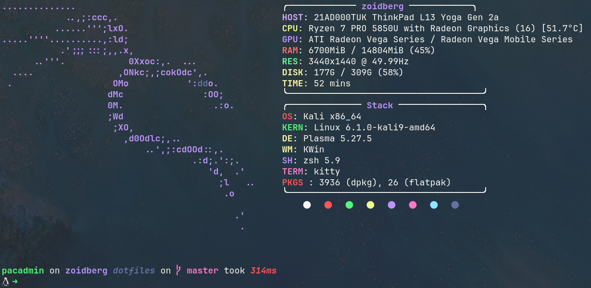

# Dotfiles Collection 👨‍💻

This is my collection of dotfiles, which includes configurations and settings for various tools and applications. It emphasizes the usage of Zsh, Oh My Zsh, Starship, and the Dracula theme to create a powerful and visually appealing terminal environment.



## Prerequisites 🛠️

To make the most out of this dotfiles collection, ensure that the following dependencies are installed:

- Zsh: A powerful shell with advanced features and customization options. 🐚
- Oh My Zsh: A community-driven framework for managing Zsh configurations. 🙌
- Starship: A minimalistic and fast shell prompt. ⭐
- Stow: A symlink manager that simplifies the organization and installation of dotfiles. 📦
- Dracula Theme: A dark color scheme for various applications and environments. 🧛‍♂️🌙

## Installation 🚀

1. Clone the repository:
```shell
git clone https://github.com/yourusername/dotfiles.git
```
2. Change to the dotfiles directory:
```shell
cd dotfiles
```
## 3. Install Zsh:

#### On macOS, use Homebrew:
```shell
brew install zsh
```
#### On Ubuntu, use apt:

```shell
 sudo apt-get install zsh
```
## 4. Install Oh My Zsh:

```shell
sh -c "$(curl -fsSL https://raw.githubusercontent.com/ohmyzsh/ohmyzsh/master/tools/install.sh)"
```
n.b.: Some of the plugins installed are outsite of ohmyzsh collection, they need to be cloned into the $ZSH_CUSTOM directory.

## 5. Install Starship:

#### On macOS, use Homebrew:

```shell
brew install starship
```
#### On Ubuntu, use snap:

```shell
    sudo snap install starship
```
## 6. Install GNU Stow
- On macOS, use Homebrew:

```shell
brew install stow
```
On Ubuntu, use apt:
```shell
sudo apt-get install stow
```
## 7. Configure Zsh, Oh My Zsh, and Starship:

Copy the dotfiles to the appropriate locations and unstow.
```shell
 cd ~/dotfiles
 stow -v */
```

Edit the configurations to customize them according to your preferences.

Set Zsh as the default shell:

```shell
chsh -s $(which zsh)
```

 Restart your terminal or start a new session to see the changes.

## Extra ✨

I've also created a handy script to effortlessly check and pull configurations across my devices. Feel free to explore the script [here](https://github.com/pakyrs/check_and_pull). 🚀

With this script, you can easily ensure that your configurations are up to date across different devices. Simply run the script to check for updates and perform a pull if needed. It's a convenient way to keep your configurations synchronized and avoid missing out on any improvements or new features. ✨

Some handy dot.. aliases are in this repo to help.

## Customization 🎨

Feel free to customize the dotfiles and configurations to match your preferences. Explore the different themes and options provided by Oh My Zsh, Starship, and the Dracula theme to create your own unique terminal environment.
Contributing

## Contributing 🤝

Contributions to this dotfiles collection are welcome! If you have any suggestions, improvements, or bug fixes, please feel free to open an issue or submit a pull request.
License

## License 📝

This project is licensed under the MIT License.
